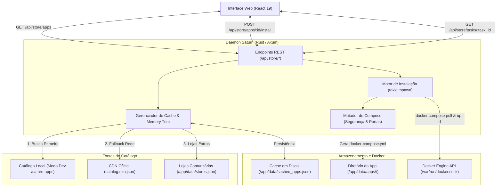

# Saturn App Store — Especificação Técnica e Guia do Desenvolvedor

Este documento descreve a arquitetura interna, o modelo de concorrência, o ciclo de vida de instalação e os requisitos formais de empacotamento da **Saturn App Store** e do repositório [`Andrevictor20/saturn-apps`](https://github.com/Andrevictor20/saturn-apps).

---

## 1. Arquitetura do Subsistema da App Store

O subsistema de catálogo do Saturn foi projetado para desacoplar a oferta de aplicativos do ciclo de release do dashboard principal. O catálogo opera sob um modelo distribuído baseado em índices minificados e tarefas assíncronas de instalação orquestradas pelo daemon Rust.



### 1.1. Sincronização e Resiliência do Catálogo
A descoberta de aplicativos utiliza uma estratégia progressiva em camadas:

1. **Descoberta Local em Desenvolvimento:**  
   O backend verifica a presença do catálogo local em caminhos relativos ao binário (`saturn-apps/catalog.json`, `../saturn-apps/catalog.json`, `/app/saturn-apps/catalog.json`). Caso encontrado, o carregamento é instantâneo e dispensa requisições de rede.
2. **Sincronização Remota via CDN:**  
   Em produção, o daemon realiza uma requisição assíncrona (`reqwest` com timeout estrito de 30 segundos e User-Agent `Saturn-Dashboard/1.0`) para a CDN oficial ou repositórios cadastrados.
3. **Persistência em Disco e Retenção em Memória:**  
   O resultado consolidado é gravado em `/app/data/cached_apps.json` e indexado na memória estática (`APPS_CACHE` e `APPS_JSON_CACHE`).
4. **Gerenciamento de Memória (`malloc_trim`):**  
   Após o parsing e serialização de catálogos com centenas de aplicações, o backend invoca `libc::malloc_trim(0)` em hosts Linux, devolvendo as arenas de memória não utilizadas imediatamente ao kernel operacional.

### 1.2. Detecção Dinâmica de Arquitetura do Host
O backend consulta a arquitetura do processador do servidor em tempo de execução via chamadas nativas do subsistema `sysinfo`:
- **Identificação do Host:** Mapeado como `x86_64` (amd64) ou `aarch64` (arm64).
- **Validação de Compatibilidade:** A API compara o processador com o array `architectures` declarado no manifesto de cada aplicação.
- **Filtragem na Interface:** O frontend sinaliza aplicativos incompatíveis por meio de badges de alerta e provê a opção de ocultação estrita, prevenindo tentativas de pull de imagens incompatíveis com a arquitetura local.

---

## 2. Ciclo de Vida da Instalação e Execução

A instalação de um aplicativo da loja é executada de forma assíncrona em segundo plano, sem bloquear as threads do servidor nem as requisições do cliente web.

### 2.1. Endpoints da API da Loja

| Método | Endpoint | Função Técnica |
| :--- | :--- | :--- |
| `GET` | `/api/store/apps` | Retorna o catálogo unificado de aplicações disponíveis |
| `GET` | `/api/store/apps/:id/inspect` | Retorna a configuração padrão (portas, volumes, variáveis e compose bruto) para personalização |
| `POST` | `/api/store/apps/:id/install` | Inicia a instalação padrão em segundo plano, retornando `{ "task_id": "uuid" }` |
| `POST` | `/api/store/apps/:id/install/custom` | Inicia instalação com overrides (`env`, `ports`, `volumes`) via `CustomInstallPayload` |
| `GET` | `/api/store/tasks/:task_id` | Retorna o progresso atual (0 a 100%), status e stream de logs da execução |
| `POST` | `/api/store/tasks/:task_id/cancel` | Interrompe o processo imediatamente e executa limpeza de recursos |
| `DELETE` | `/api/store/apps/:id/uninstall` | Executa `docker compose down` e remove o diretório do aplicativo |
| `GET` | `/api/store/repositories` | Lista os repositórios de catálogo ativos |
| `POST` | `/api/store/repositories` | Adiciona um repositório comunitário (`/app/data/stores.json`) e agenda sincronização |

### 2.2. Fases de Execução da Tarefa (`InstallTask`)

1. **Preparação (`preparing`, 0% - 10%):**  
   O daemon cria o diretório isolado do aplicativo em `data/apps/<safe_id>/`.
2. **Mutação do Compose (`compose_mutator.rs`):**  
   O arquivo bruto é processado para impor guardrails operacionais:
   - **Remoção de `network_mode: host`:** Substituído pela rede padrão bridge com mapeamento determinístico de portas.
   - **Normalização de Caminhos:** Substitui variáveis legadas como `/DATA/AppData/$AppID` por caminhos relativos ao diretório do aplicativo ou persistência estruturada.
   - **Hardening de Logs:** Injeção obrigatória do driver `json-file` com rotação automática (`max-size: 10m`, `max-file: 3`) para impedir o esgotamento do disco do host.
   - **Aceleração de Download:** Injeção das variáveis de ambiente de alta performance: `DOCKER_BUILDKIT=1` e `COMPOSE_PARALLEL_LIMIT=8`.
3. **Download de Imagens (`pulling`, 10% - 70%):**  
   Executa `docker compose pull` de forma assíncrona, capturando a saída padrão linha a linha via pipes não-bloqueantes (`tokio::io::AsyncBufReadExt`).
4. **Subida dos Serviços (`installing`, 70% - 90%):**  
   Executa `docker compose up -d`, monitorando o exit code do processo.
5. **Finalização (`done`, 100%):**  
   Valida o estado dos contêineres criados e atualiza a tarefa para concluída.
6. **Cancelamento Atômico (`cancelled`):**  
   Caso o usuário clique em Cancelar, o processo filho do Docker é terminado via sinal SIGKILL (`kill`), a rotina executa `docker compose down -v` no diretório e remove todos os arquivos residuais.

---

## 3. Estrutura de Arquivos de um Aplicativo

Todas as aplicações do catálogo oficial residem no repositório [`Andrevictor20/saturn-apps`](https://github.com/Andrevictor20/saturn-apps) sob a pasta `apps/<id-do-app>/`. Cada aplicação exige rigorosamente 4 arquivos:

```
saturn-apps/
└── apps/
    └── <id-do-app>/
        ├── saturn-app.yml       # Manifesto de metadados, arquitetura e categorização
        ├── docker-compose.yml   # Definição padronizada de serviços Docker Compose
        ├── icon.png             # Ícone oficial da aplicação (PNG quadrado)
        └── README.md            # Guia técnico de primeiro acesso e portas
```

---

## 4. Especificação dos Manifestos

### 4.1. `saturn-app.yml` (Manifesto de Metadados)

O manifesto declara as propriedades exibidas na loja e os requisitos de hardware:

```yaml
id: uptime-kuma                       # Identificador único (minúsculas, alfanumérico e hífens)
name: Uptime Kuma                     # Nome comercial do serviço
title:
  pt_BR: Monitor de Uptime Auto-Hospedado
  en_US: Self-hosted Monitoring Tool
tagline:
  pt_BR: Ferramenta moderna e reativa para monitoramento de serviços HTTP, TCP e DNS
  en_US: A fancy self-hosted monitoring tool for HTTP, TCP, and DNS services
description:
  pt_BR: O Uptime Kuma é uma ferramenta de monitoramento com suporte a múltiplos protocolos, páginas de status públicas personalizáveis e integração com dezenas de provedores de notificação (Telegram, Discord, Webhooks).
  en_US: Uptime Kuma is a self-hosted monitoring tool with multi-protocol support, customizable status pages, and integrations with numerous notification channels.
category: Utilitarios                 # Categoria: Desenvolvimento, Midia, Produtividade, Redes, Utilitarios
architectures:
  - amd64                             # Suporte verificado para sistemas x86_64
  - arm64                             # Suporte verificado para ARM64 (Raspberry Pi 4/5)
port_map: "3001"                      # Porta primária do contêiner para link no painel
developer: Louis Lam                  # Desenvolvedor ou organização upstream
website: https://uptime.kuma.pet      # Página oficial do projeto
screenshot: []                        # Lista opcional de capturas de tela
```

#### Dicionário de Campos do Manifesto

| Campo | Tipo | Obrigatório | Restrições e Regras de Validação |
| :--- | :--- | :--- | :--- |
| `id` | `string` | **Sim** | Deve corresponder exatamente ao nome do diretório (`^[a-z0-9-]+$`). |
| `name` | `string` | **Sim** | Nome oficial e legível da aplicação. |
| `title` | `map[string]string` | **Sim** | Título explicativo curto em `pt_BR` e `en_US`. |
| `tagline` | `map[string]string` | **Sim** | Resumo em uma linha (máximo 120 caracteres). |
| `description`| `map[string]string`| **Sim** | Explicação técnica detalhada das capacidades do aplicativo. |
| `category` | `string` | **Sim** | Um dos valores: `Desenvolvimento`, `Midia`, `Produtividade`, `Redes`, `Utilitarios`. |
| `architectures`| `list[string]` | **Sim** | Deve conter `amd64`, `arm64` ou ambos. Não declarar arquiteturas sem suporte oficial na imagem Docker. |
| `port_map` | `string` | **Sim** | Número da porta interna do contêiner exposta pelo serviço web primário. |
| `developer` | `string` | **Sim** | Autor original ou entidade mantenedora do software. |
| `website` | `string` | **Sim** | URL HTTP/HTTPS válida para a documentação ou site oficial. |
| `screenshot` | `list[string]` | Não | URLs ou caminhos relativos de capturas de demonstração. |

---

### 4.2. `docker-compose.yml` (Definição de Serviços)

O compose deve seguir padrões estritos para garantir compatibilidade com qualquer servidor host:

```yaml
services:
  uptime-kuma:
    image: louislam/uptime-kuma:1
    container_name: uptime-kuma
    restart: unless-stopped
    ports:
      - "3001:3001"
    volumes:
      - /DATA/AppData/uptime-kuma/data:/app/data
      - /var/run/docker.sock:/var/run/docker.sock:ro
    environment:
      - TZ=America/Sao_Paulo
    logging:
      driver: "json-file"
      options:
        max-size: "10m"
        max-file: "3"
```

#### Regras Mandatórias do Docker Compose:
1. **Padrão de Volumes:** Diretórios de dados persistentes devem apontar para `/DATA/AppData/<id-do-app>/<subdiretório>`.
2. **Imagens Oficiais e Multi-Arch:** Utilize tags estáveis de registros públicos confiáveis (Docker Hub, GHCR). Evite imagens monolíticas de repositórios não mantidos.
3. **Mapeamento Explícito de Portas:** Sempre utilize o formato `"HOST:CONTAINER"`. Proibido utilizar `network_mode: host` a menos que seja um serviço estritamente dependente de broadcast L2 (ex.: servidores mDNS ou certos coletores de rede).
4. **Política de Reinicialização:** Definir `restart: unless-stopped` para tolerância a falhas e reinícios do host.
5. **Configuração de Logs:** Toda aplicação deve conter a declaração `logging` com driver `json-file`, `max-size: 10m` e `max-file: 3`.

---

### 4.3. `icon.png` (Especificação Gráfica)
- **Formato:** PNG com canal alfa (transparência) ou fundo sólido contrastante.
- **Dimensões:** Exatamente **256x256 px** ou **512x512 px** (proporção 1:1).
- **Tratamento:** Não aplique bordas circulares ou arredondadas artificialmente na imagem; o estilo de cantos arredondados é aplicado dinamicamente pelo frontend do Saturn.

---

### 4.4. `README.md` (Documentação do Aplicativo)

O `README.md` deve conter as instruções técnicas de primeiro uso consumidas pelo usuário:

```markdown
# Uptime Kuma

Monitor de serviços e páginas de status de alta disponibilidade.

## Acesso Inicial
- **Porta Padrão:** `3001`
- **URL Local:** `http://<ip-do-servidor>:3001`
- **Configuração:** No primeiro carregamento, crie a conta do administrador diretamente na interface gráfica.

## Volumes e Dados
- `/DATA/AppData/uptime-kuma/data`: Banco SQLite e configurações de monitores.
```

---

## 5. Como Adicionar um Novo Aplicativo (Passo a Passo)

### Passo 1: Obtenção do Código-Fonte do Repositório da Loja
Faça um Fork do repositório [`Andrevictor20/saturn-apps`](https://github.com/Andrevictor20/saturn-apps) e clone localmente:

```bash
git clone https://github.com/<seu-usuario>/saturn-apps.git
cd saturn-apps
```

### Passo 2: Inicialização da Nova Aplicação
Crie o diretório do aplicativo copiando o template oficial:

```bash
cp -r _template apps/meu-app
cd apps/meu-app
```

Renomeie e edite os arquivos de acordo com as especificações da seção 4:
1. Preencha `saturn-app.yml` com metadados reais e as arquiteturas confirmadas.
2. Configure `docker-compose.yml` com as portas e volumes adequados.
3. Adicione o ícone oficial em `icon.png` (256x256 px).
4. Documente as instruções de primeiro uso em `README.md`.

### Passo 3: Compilação e Validação com o Compilador Oficial
O repositório possui uma ferramenta em Python (`compiler/build_catalog.py`) que valida a estrutura de diretórios, formatação dos YAMLs e compila os índices consolidados:

```bash
python3 compiler/build_catalog.py
```

O compilador realiza as seguintes checagens determinísticas:
- [x] Unicidade de IDs em todo o catálogo.
- [x] Correspondência entre o nome da pasta e o campo `id`.
- [x] Validação sintática dos manifestos YAML.
- [x] Existência dos 4 arquivos obrigatórios em cada pasta.
- [x] Validação das dimensões e formato de `icon.png`.
- [x] Geração dos arquivos finais: `catalog.json` e `catalog.min.json`.

Certifique-se de que a compilação execute com saída limpa e código de retorno zero (`0`).

### Passo 4: Validação em Ambiente Local no Saturn
Caso você tenha o Saturn Dashboard em execução no mesmo ambiente de desenvolvimento, posicione a pasta `saturn-apps` no mesmo nível de diretório do Saturn (`../saturn-apps`). O backend do Saturn detectará o catálogo local automaticamente durante a inicialização, permitindo testar a interface de compra e a instalação antes de abrir o Pull Request.

### Passo 5: Submissão do Pull Request
1. Adicione os novos arquivos ao Git:
   ```bash
   git checkout -b app/meu-app
   git add apps/meu-app catalog.json catalog.min.json
   git commit -m "feat(store): adiciona aplicacao meu-app"
   git push origin app/meu-app
   ```
2. Abra um Pull Request contra o branch `main` de `Andrevictor20/saturn-apps`.
3. A esteira de CI validará a integridade do catálogo e o PR será avaliado pelos mantenedores.

---

## 6. Criação de Repositórios Comunitários Independentes

Caso deseje criar e hospedar um catálogo customizado sem depender do repositório oficial:

1. **Estrutura de Hospedagem:**  
   Mantenha um repositório Git com a mesma estrutura de `saturn-apps` e compile os arquivos `catalog.json` e `catalog.min.json`.
2. **Disponibilização HTTP:**  
   Hospede o arquivo compilado em qualquer servidor estático ou serviço de páginas (ex.: GitHub Pages, Cloudflare Pages ou servidor local Nginx).
3. **Registro no Saturn:**  
   Acesse **App Store** > **Gerenciar Fontes da Loja** no painel do Saturn, insira o nome e a URL direta do `catalog.json`. O daemon salvará a configuração em `/app/data/stores.json` e sincronizará os novos aplicativos imediatamente.
