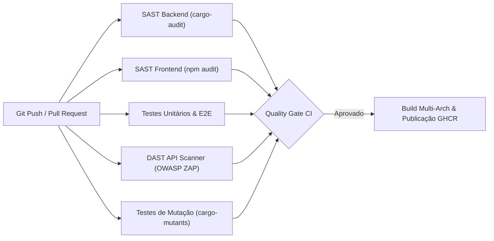

# Segurança da Informação e Políticas de Proteção - Saturn

Este documento detalha o modelo de ameaças, os controles criptográficos, a arquitetura de autorização e as práticas de DevSecOps aplicadas ao Saturn.

---

## 1. Princípios Fundamentais de Segurança

O desenvolvimento do Saturn orienta-se pelos princípios de **Security by Design**, **Princípio do Menor Privilégio** e conformidade com os guias de segurança do **OWASP Top 10** e **OWASP API Security Top 10**.

### Modelo de Confiança (Trust Boundaries)
- **Superfície Exposta (Fronteira Não Confiável):** Requisições HTTP e conexões WebSocket originadas no navegador do usuário ou através de proxies reversos e túneis.
- **Fronteira Confiável Interna:** O daemon Rust (Axum), o volume local persistente (`/app/data`) e a comunicação direta com o Docker Engine via `/var/run/docker.sock`.
- **Prevenção de Movimentação Lateral:** Credenciais sensíveis (como tokens de acesso do Home Assistant) são mantidas restritas ao backend e nunca propagadas para o cliente web.

---

## 2. Controles Criptográficos e Gestão de Sessão

### 2.1 Hashing de Credenciais com Argon2id
- Senhas de usuários não são persistidas em texto plano.
- Utiliza-se o algoritmo **Argon2id** (vencedor do *Password Hashing Competition*), configurado com parâmetros de memória e iterações recomendados para resistência contra ataques acelerados por hardware dedicado (GPU e ASIC).

### 2.2 Gestão de Sessão e Segredos JWT
- Na inicialização inicial (*First-Boot Wizard* em `/setup`), caso não exista segredo configurado, o sistema gera uma chave criptográfica de 64 bytes através de um gerador de números pseudo-aleatórios criptograficamente seguro (CSPRNG): `rand::random::<[u8; 64]>()`.
- A chave é persistida com permissões de arquivo restritas em `data/jwt.secret`.
- Os tokens de sessão JWT são transmitidos preferencialmente através de cookies `HttpOnly` com flags `SameSite` apropriadas, mitigando riscos de extração via scripts maliciosos (XSS), com suporte adicional a cabeçalhos `Authorization: Bearer <token>` para integração programática.

### 2.3 Proteção contra Ataques de Força Bruta (Rate Limiting)
- O endpoint de autenticação `/api/auth/login` possui limitador de taxa de requisições por endereço IP de origem.
- Tentativas sucessivas de autenticação incorreta incorrem em bloqueio temporário (status `HTTP 429 Too Many Requests`), contendo tentativas automatizadas de adivinhação de senhas.

---

## 3. Hardening de APIs e Proteção de Recursos do Host

### 3.1 Proteção contra IDOR no Gerenciamento de Processos (`kill_process`)
Para impedir negação de serviço do host ou auto-interrupção acidental do dashboard, o endpoint de encerramento de processos impõe verificações estritas:
- **Proteção de PID Raiz:** Rejeição mandatória para PID 0 e PID 1 (`init` / `systemd`).
- **Proteção do Próprio Binário:** Identificação e rejeição para o PID do próprio processo Saturn (`std::process::id()`).
- **Blocklist de Daemons Críticos:** Rejeição para processos essenciais do host operacional, incluindo `systemd`, `sshd`, `dockerd` e `containerd`.

### 3.2 Isolamento de Rotas Administrativas e Logs
- Rotas de auditoria de sistema (`/api/logs` e `/api/logs/clear`) são estritamente isoladas pelo middleware de autorização `auth::require_auth`. Requisições não autenticadas são rejeitadas com status `HTTP 401 Unauthorized`.

### 3.3 Redução de Superfície de Ataque e Foco Homelab
- Credenciais e integrações legadas de provedores de nuvem pública de terceiros foram descontinuadas do núcleo do dashboard, eliminando chaves de API estáticas e bibliotecas de terceiros desnecessárias da cadeia de dependências.

### 3.4 Sanitização de Conteúdo no Editor de Texto
- O visualizador de Markdown e editor de arquivos (`TextEditorModal`) higieniza esquemas de links antes da renderização em tela, bloqueando a execução de esquemas arbitrários como `javascript:`, `data:` e `vbscript:`.

---

## 4. Política de Rede e Cabeçalhos HTTP Defensivos

### 4.1 Política de CORS Dinâmico (Restrição de Origens)
Para mitigar requisições forjadas entre sites (CSRF) originadas da internet pública enquanto viabiliza o acesso doméstico legítimo em servidores homelab, a política de CORS valida dinamicamente se a origem requisitante pertence a:
- Loopback local (`localhost`, `127.0.0.1`).
- Sub-redes privadas RFC 1918 (`10.0.0.0/8`, `172.16.0.0/12` a `172.31.0.0/12`, `192.168.0.0/16`).
- Domínios locais mDNS (`.local`, `.lan`).
- Redes privadas seguras Tailscale (faixa CGNAT `100.64.0.0/10` e domínios `*.ts.net`).
- Conexões seguras via Cloudflare Tunnels (`*.trycloudflare.com`).

Origens públicas não autorizadas são rejeitadas com erro HTTP 403 Forbidden.

### 4.2 Cabeçalhos de Segurança HTTP
O backend Axum injeta em todas as respostas os cabeçalhos de segurança padronizados pelo OWASP:

| Cabeçalho | Valor Padronizado | Função de Segurança |
| :--- | :--- | :--- |
| `Content-Security-Policy` | `default-src 'self'; ...` | Restringe origens de carregamento de scripts e estilos contra ataques XSS |
| `X-Frame-Options` | `DENY` | Impede a inclusão do painel em `<iframe>` de terceiros (Clickjacking) |
| `X-Content-Type-Options` | `nosniff` | Impede que o navegador interprete arquivos com tipos MIME divergentes |
| `Referrer-Policy` | `strict-origin-when-cross-origin` | Limita o vazamento de caminhos de URLs em requisições externas |
| `Strict-Transport-Security` | `max-age=31536000; includeSubDomains` | Instrui o navegador a forçar comunicação criptografada HTTPS |

---

## 5. Pipeline Automatizado de DevSecOps

A verificação de segurança é executada de forma automatizada no pipeline de Integração Contínua (GitHub Actions) a cada alteração submetida ao repositório:

1. **SAST Backend (`cargo-audit`):** Varredura de crates na base de dados RustSec Advisory Database para bloqueio preventivo de dependências com CVEs relatadas.
2. **SAST Frontend (`npm audit`):** Inspeção de pacotes Node.js contra vulnerabilidades de severidade Alta ou Crítica.
3. **DAST (OWASP ZAP API Scan):** Varredura dinâmica de endpoints REST da API procurando falhas de injeção, vazamento de erros de runtime e configurações inseguras de cabeçalhos.
4. **Testes de Mutação (`cargo-mutants`):** Validação da eficácia dos testes de segurança, confirmando que alterações arbitrárias em validações de autorização e rate limiting causam falha imediata na suíte de testes.

---

## 6. Notificação de Vulnerabilidades

Caso identifique uma potencial falha de segurança no Saturn, solicitamos a abertura de um relatório privado através da funcionalidade de **Security Advisories** do GitHub no repositório oficial (`Andrevictor20/saturn`), ou via contato direto com os mantenedores. Vulnerabilidades reportadas são tratadas com prioridade e processo coordenado de correção prévia à divulgação pública.
